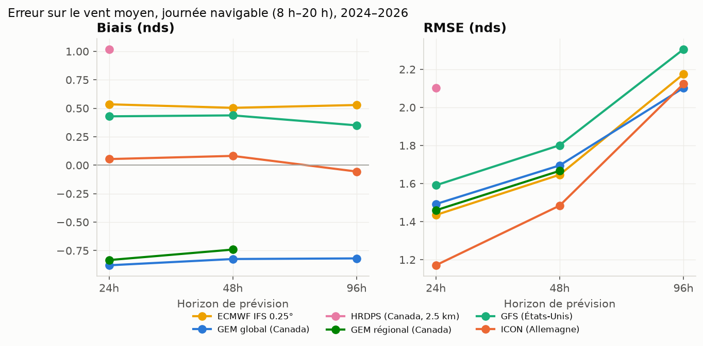
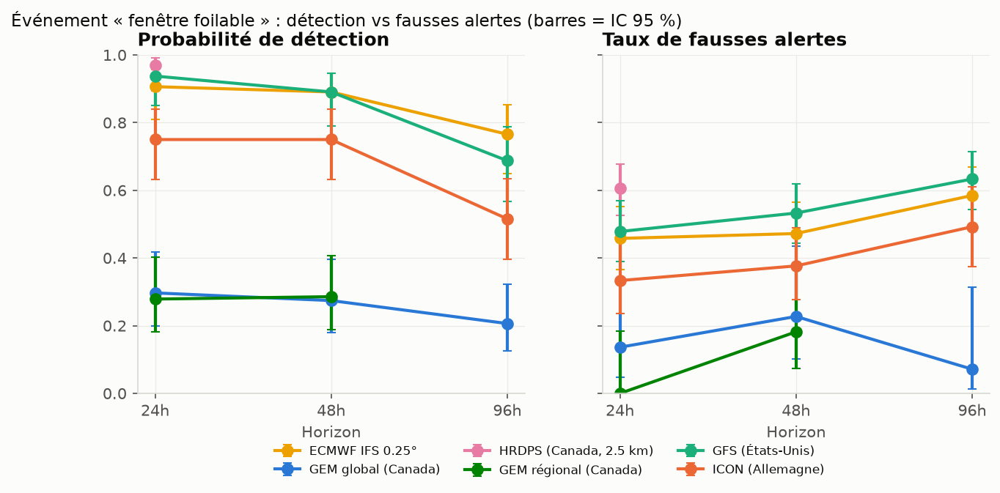
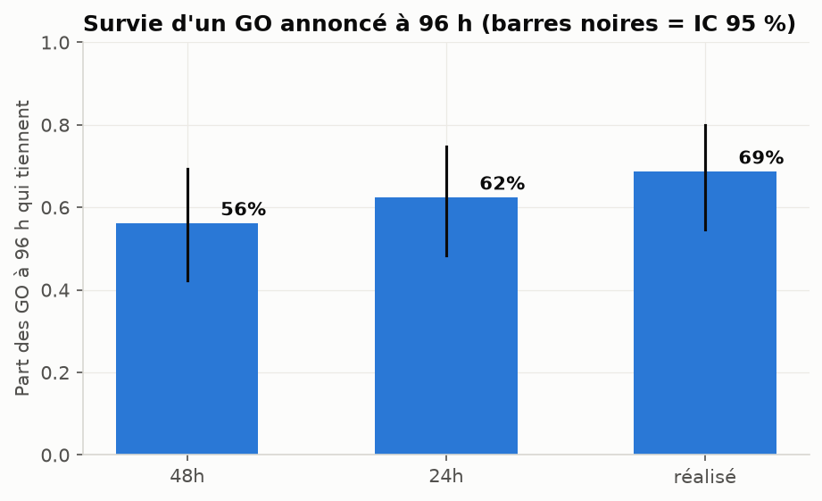
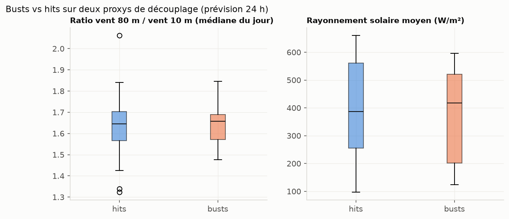

# Rapport de backtest — vent au Lac Maskinongé

Période analysée : 2024-05-01 à 2026-07-12 (mai-octobre). Spot : 46.3123° N,
-73.3638° O. Unités : nœuds (nds). Vérité terrain : médiane multi-modèles des
séries « hour-0 » (voir la section Limites).

## L'essentiel en langage clair

- **Ton spot est un spot de vent léger.** Vent médian en journée :
  5 nds ; il faut monter au 90e percentile pour toucher
  8 nds. La barre foilable (9 nds) est donc un événement rare :
  **2024 : 25 sur 184 ; 2025 : 27 sur 184 ; 2026 : 12 sur 73 jours foilables** — grosso modo un jour sur sept. Le système
  ne cherche pas à prévoir le vent « en général », il cherche à attraper ces
  jours-là sans te faire monter au chalet pour rien.

- **Pris un par un, les modèles ne s'entendent pas du tout.** À 24 h
  d'échéance, au moins un modèle annonce une journée GO 179 fois —
  mais les six s'entendent seulement 12 fois. À la même heure, l'écart
  typique entre le modèle le plus optimiste et le plus pessimiste est de
  3 nds (et dépasse 5 nds un jour sur dix) —
  énorme quand le seuil GO/NO-GO est à 9 nds. C'est exactement pourquoi lire
  une seule app météo marche mal ici, et pourquoi la pondération multi-modèles
  de ce projet a une chance de faire mieux.

- **Chaque modèle a un caractère mesurable et stable.** Les GEM canadiens
  lisent systématiquement bas (-0.9 nds au consensus à 24 h) :
  quand ils disent GO, c'est fiable, mais ils ratent la majorité des vraies
  fenêtres. HRDPS lit haut (+1.0 nds) : il ne rate presque rien
  mais crie au loup 61% du temps. Ce sont ces biais-là, mesurés à
  ce spot précis, que `poids_modeles.json` corrige.

- **La distance d'échéance coûte cher.** Un GO annoncé 4 jours d'avance ne
  tient que 69% du temps ; à 24 h,
  85%. La décision « chalet » se prend donc sur une
  cote, jamais sur une certitude — et le dashboard l'affichera toujours
  comme telle.

## Conclusions d'abord

1. **Quel modèle croire à ce spot ?** À 24 h, le plus précis est
   **ICON (Allemagne)** (RMSE 1.2 nds,
   biais +0.1 nds). À 96 h — l'horizon de la décision
   « chalet » — c'est **GEM global (Canada)**
   (RMSE 2.1 nds). *RMSE = erreur typique : à ±2 nds
   près, c'est l'incertitude à laquelle s'attendre sur une heure donnée.*

2. **Qui surestime ?** Le biais le plus marqué est celui de
   **HRDPS (Canada, 2.5 km)** à 24h
   (+1.0 nds en moyenne). Un biais positif = le modèle
   annonce plus de vent qu'il n'en arrive : c'est lui qui fabrique des faux GO.

3. **Quelle confiance accorder à un GO selon l'horizon ?** Sur la prévision
   d'ensemble (médiane des modèles) :
   - GO annoncé à **96 h** : confirmé 69% du temps
     (fourchette 55%–80%, 48 cas).
   - GO annoncé à **48 h** : confirmé 76% du temps
     (63%–86%, 51 cas).
   - GO annoncé à **24 h** : confirmé 85% du temps
     (74%–92%, 60 cas).

   Autrement dit, un « GO chalet » lancé 4 jours d'avance doit se lire comme
   une cote, pas une promesse — et le dashboard l'affichera toujours ainsi.

4. **Les busts ont-ils une signature ?** Sur 57 journées GO à
   24 h, 6 ont été des busts complets (vent resté sous 9 nds toute la
   journée). **Non — pas encore de signature détectable.** Les médianes des
   proxys de découplage sont quasi identiques entre busts et bons jours
   (cisaillement 1.66 contre 1.65 ; rayonnement 418 contre
   387 W/m²), et 6 cas ne permettent aucune conclusion (le seuil
   de ce rapport est n ≥ 30 par cellule ; on est loin en dessous). Deux
   lectures : (a) la vérité actuelle étant une médiane de modèles, elle est
   corrélée aux prévisions — les vrais busts « grille dit vent, lac dit rien »
   sont invisibles par construction et ne le resteront pas quand la station au
   lac (phase 4) fournira une vérité indépendante ; (b) tant qu'aucune
   signature n'est validée, le dashboard n'affichera PAS de drapeau
   « découplage » — un drapeau non validé serait de la fausse précision. Le
   diagnostic sera relancé automatiquement quand la vérité station existera.

## Erreur sur le vent moyen (biais et RMSE)

| Modèle                 | Horizon   |    n |   Biais (nds) |   RMSE (nds) |
|:-----------------------|:----------|-----:|--------------:|-------------:|
| ICON (Allemagne)       | 24h       | 5292 |          0.05 |         1.17 |
| ECMWF IFS 0.25°        | 24h       | 5292 |          0.54 |         1.43 |
| GEM régional (Canada)  | 24h       | 5149 |         -0.83 |         1.46 |
| GEM global (Canada)    | 24h       | 5292 |         -0.88 |         1.49 |
| GFS (États-Unis)       | 24h       | 5292 |          0.43 |         1.59 |
| HRDPS (Canada, 2.5 km) | 24h       | 5292 |          1.02 |         2.1  |
| ICON (Allemagne)       | 48h       | 5292 |          0.08 |         1.48 |
| ECMWF IFS 0.25°        | 48h       | 5292 |          0.5  |         1.65 |
| GEM régional (Canada)  | 48h       | 5287 |         -0.74 |         1.67 |
| GEM global (Canada)    | 48h       | 5160 |         -0.82 |         1.7  |
| GFS (États-Unis)       | 48h       | 5292 |          0.44 |         1.8  |
| GEM global (Canada)    | 96h       | 5232 |         -0.82 |         2.1  |
| ICON (Allemagne)       | 96h       | 5292 |         -0.06 |         2.12 |
| ECMWF IFS 0.25°        | 96h       | 5292 |          0.53 |         2.17 |
| GFS (États-Unis)       | 96h       | 5292 |          0.35 |         2.3  |

Rappels de lecture : HRDPS ne porte que 48 h de prévision (pas de colonne 96 h),
GEM régional s'arrête à 84 h (pas de 96 h non plus).

## Événement « fenêtre foilable » : détection et fausses alertes

Fenêtre foilable = au moins 2 h entre 9 et 25 nds, entre 8 h et 20 h locales,
créux passagers 7–9 nds tolérés (voir config.py). Probabilité de détection
(POD) = part des vraies fenêtres que le modèle avait annoncées. Taux de
fausses alertes (FAR) = part des GO annoncés qui ne se sont pas matérialisés.

| Modèle                 | Horizon   |   Jours |   Fenêtres réelles |   Hits |   Fausses alertes |   Manqués | POD (IC 95 %)   | FAR (IC 95 %)   |
|:-----------------------|:----------|--------:|-------------------:|-------:|------------------:|----------:|:----------------|:----------------|
| GEM régional (Canada)  | 24h       |     428 |                 61 |     17 |                 0 |        44 | 28% (18%–40%)   | 0% (0%–18%)     |
| GEM global (Canada)    | 24h       |     441 |                 64 |     19 |                 3 |        45 | 30% (20%–42%)   | 14% (5%–33%)    |
| ICON (Allemagne)       | 24h       |     441 |                 64 |     48 |                24 |        16 | 75% (63%–84%)   | 33% (24%–45%)   |
| ECMWF IFS 0.25°        | 24h       |     441 |                 64 |     58 |                49 |         6 | 91% (81%–96%)   | 46% (37%–55%)   |
| GFS (États-Unis)       | 24h       |     441 |                 64 |     60 |                55 |         4 | 94% (85%–98%)   | 48% (39%–57%)   |
| HRDPS (Canada, 2.5 km) | 24h       |     441 |                 64 |     62 |                95 |         2 | 97% (89%–99%)   | 61% (53%–68%)   |
| GEM régional (Canada)  | 48h       |     440 |                 63 |     18 |                 4 |        45 | 29% (19%–41%)   | 18% (7%–39%)    |
| GEM global (Canada)    | 48h       |     430 |                 62 |     17 |                 5 |        45 | 27% (18%–40%)   | 23% (10%–43%)   |
| ICON (Allemagne)       | 48h       |     441 |                 64 |     48 |                29 |        16 | 75% (63%–84%)   | 38% (28%–49%)   |
| ECMWF IFS 0.25°        | 48h       |     441 |                 64 |     57 |                51 |         7 | 89% (79%–95%)   | 47% (38%–57%)   |
| GFS (États-Unis)       | 48h       |     441 |                 64 |     57 |                65 |         7 | 89% (79%–95%)   | 53% (44%–62%)   |
| GEM global (Canada)    | 96h       |     436 |                 63 |     13 |                 1 |        50 | 21% (12%–32%)   | 7% (1%–31%)     |
| ICON (Allemagne)       | 96h       |     441 |                 64 |     33 |                32 |        31 | 52% (40%–63%)   | 49% (37%–61%)   |
| ECMWF IFS 0.25°        | 96h       |     441 |                 64 |     49 |                69 |        15 | 77% (65%–85%)   | 58% (49%–67%)   |
| GFS (États-Unis)       | 96h       |     441 |                 64 |     44 |                76 |        20 | 69% (57%–79%)   | 63% (54%–71%)   |

## Survie des fenêtres : le chiffre de la décision « chalet »

Parmi les GO annoncés à 96 h par l'ensemble : 33 sur
48 se sont réalisés (69%,
fourchette 55%–80%).

| GO annoncé à   | Vérifié à   |   Cas |   Tiennent | Taux (IC 95 %)   |
|:---------------|:------------|------:|-----------:|:-----------------|
| 96h            | 48h         |    48 |         27 | 56% (42%–69%)    |
| 96h            | 24h         |    48 |         30 | 62% (48%–75%)    |
| 96h            | réalisé     |    48 |         33 | 69% (55%–80%)    |
| 48h            | réalisé     |    51 |         39 | 76% (63%–86%)    |
| 24h            | réalisé     |    60 |         51 | 85% (74%–92%)    |

## Diagnostic des busts

| Variable           |   Médiane hits |   Médiane busts |   n hits |   n busts |
|:-------------------|---------------:|----------------:|---------:|----------:|
| cisaillement       |           1.65 |            1.66 |       51 |         6 |
| rayonnement_moyen  |         387.17 |          417.73 |       51 |         6 |
| nebulosite_moyenne |          42.75 |           59.65 |       51 |         6 |
| inversion          |          -1.13 |           -1    |       51 |         6 |

Variables : cisaillement = ratio vent 80 m / vent 10 m (médiane 8 h–20 h) ;
inversion = temp. 80 m − temp. 2 m en °C (positif = air stable, découplage
probable). La hauteur de couche limite n'est archivée pour aucun modèle chez
Open-Meteo (vérifié par appels réels) — ces proxys la remplacent.

## Stations d'observation réelles (inventaire, rayon ~40 km)

Interrogation de l'API d'Environnement Canada (api.weather.gc.ca,
collections climate-stations / climate-hourly) :

| Station | Distance | Données horaires | Couverture | Verdict |
|---|---|---|---|---|
| Lac Saint-Pierre (701LP0N) | 37 km SE | Oui (vent, direction, temp.) | 1994 → aujourd'hui | **Exploitable** comme vérité secondaire de régime synoptique. Station automatique sur le lac Saint-Pierre : bien exposée, mais plan d'eau et topographie différents — l'écart avec le lac Maskinongé est attendu et sera mesuré, pas supposé. |
| St-Gabriel-de-Brandon (7017270) | 2 km | Non (climat quotidien, fermée) | historique | Inutilisable pour le vent horaire. |
| Toutes les autres (17 stations) | 4–45 km | Non | — | Postes climatologiques quotidiens, pas de vent horaire. |

Aucune station horaire d'EC n'existe à moins de 37 km : la vérité par station
attendra l'anémomètre Ecowitt au bord du lac (phase 4).

## Limites (à lire une fois)

- **La vérité est une médiane de modèles**, pas une observation. Elle capture
  les erreurs synoptiques (la dépression qui n'arrive pas) mais pas l'écart
  résiduel entre la grille de ~10–25 km et le vent réel au milieu du lac.
  Les biais absolus seront requalifiés quand la station du cousin sera en
  place (phase 4) ; les comparaisons entre modèles et entre horizons, elles,
  restent valides.
- **Rafales ECMWF absentes des archives** (vérifié) : le ratio
  rafales/vent appris sur les autres modèles sert de repli
  (ratio médian par modèle dans `data/poids_modeles.json`).
- Le nombre de fenêtres réelles par saison est petit : toutes les proportions
  sont données avec leur intervalle de confiance à 95 % — les fourchettes
  larges sont la réalité, pas un défaut du rapport.

## Fichiers produits

- `data/poids_modeles.json` : biais, RMSE, poids (∝ 1/RMSE², normalisés par
  horizon), corrections par secteur (où n ≥ 30), ratios de rafales,
  fiabilité des GO par horizon. Schéma documenté dans le README.
- `data/processed/*.parquet` : données appariées reproductibles.
